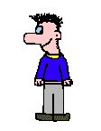
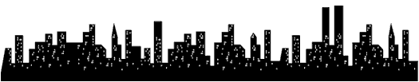

  

 

  

<!-- "Hero" Header -->

  

 
 
 
 

<table>
  <tr>
    <td align="center"><strong>Major</strong></td>
    <td align="center">Cybersecurity</td>
  </tr>
  <tr>
    <td align="center"><strong>Focus</strong></td>
    <td align="center">AI-driven Android & Embedded Security</td>
  </tr>
  <tr>
    <td align="center"><strong>Exploring</strong></td>
    <td align="center">Python · Machine Learning · Deep Learning</td>
  </tr>
  <tr>
    <td align="center"><strong>Research Style</strong></td>
    <td align="center">AI-based Security Analysis</td>
  </tr>
  <tr>
    <td align="center"><strong>Interests</strong></td>
    <td align="center">Security of AI · Embedded · Android</td>
  </tr>
</table>

 
 

<h2 align="center">Research Experience</h2>

  <table>
    <tr>
      <td style="width:25%; text-align:center; vertical-align:middle;">
        
      </td>
      <td style="width:75%; vertical-align:middle;">
        <b>CSOS Lab</b> 
        <i>Department of Software Science, Dankook University</i> 
        🔗 <a href="https://securesw.dankook.ac.kr/">Lab Homepage</a>
      </td>
    </tr>
  </table>

  

    <b>Position:</b> Research Intern 
    <b>Supervisor:</b> Prof. Seongje Cho 
    <b>Period:</b> September 2025 – Present 
    <b>Location:</b> Yongin, Republic of Korea
  

  

    • Investigating TEE-based secure deployment of post-quantum cryptography (PQC) on ARM TrustZone 
    • Researching Android Secure IDS with <b>Illinois State University</b>
      (Advisor: Prof. Hyoil Han, Prof. Kyoungwon Seo) 
    • Researching Embedded System Security with <b>Seoul National University, CSLab</b>
      (Advisor: Prof. Jiwon Seo, Ph.D. Martin Kayondo)
  

 
 

## Education

<strong>Dankook University</strong> 
<em>B.E. in Cybersecurity</em>  

• Period: Mar 2021 – Expected Jan 2027 
• Location: Yongin, Republic of Korea 
• GPA: 3.95 / 4.5 
• Status: Undergraduate (Junior)

 
 

## Awards & Scholorships

<table>
  <tr>
    <th align="center" width="30%">Date</th>
    <th align="center" width="55%">Award</th>
    <th align="center" width="15%">Organization</th>
  </tr>

  <!-- Awards -->
  <tr>
    <td align="center">Dec 2025</td>
    <td align="center">
      <b>Cyber Security Contest 1st Place Award</b>
      <ul align="center">
        <li>“A Lightweight Secret-Isolated Post-Quantum Cryptographic Architecture for ARM TrustZone”</li>
        <li>Implemented isolated secret-based computation for PQC Kyber</li>
      </ul>
    </td>
    <td align="center">Dankook University, Department of Cybersecurity</td>
  </tr>

  <tr>
    <td align="center">Sep 2025</td>
    <td align="center">
      <b>Participation Prize (3rd Place) — Dankook Startup Hackathon</b>
      <ul align="center">
        <li>Lead developer and planner of <em>Ddobak</em>, an LLM-based speech correction application</li>
        <li>Recognized for innovative AI-driven assistive healthcare design</li>
      </ul>
    </td>
    <td align="center">Dankook University, National Center of Excellence in Software</td>
  </tr>

  <!-- Scholarships -->
  <tr>
    <td align="center">Mar 2022</td>
    <td align="center">
      <b>Admission Merit Scholarship</b>
      <ul align="center">
        <li>Awarded based on outstanding academic performance at admission</li>
      </ul>
    </td>
    <td align="center">Dankook University</td>
  </tr>

  <tr>
    <td align="center">Dec 2024 & Dec 2025</td>
    <td align="center">
      <b>Mileage Scholarship (2 Times)</b>
      <ul align="center">
        <li>Awarded twice based on accumulated academic and extracurricular achievements</li>
      </ul>
    </td>
    <td align="center">Dankook University</td>
  </tr>

  <tr>
    <td align="center">Feb 2025</td>
    <td align="center">
      <b>Academic Excellence Scholarship</b>
      <ul align="center">
        <li>Awarded for high academic achievement</li>
      </ul>
    </td>
    <td align="center">Dankook University</td>
  </tr>

  <tr>
    <td align="center">Sep 2025</td>
    <td align="center">
      <b>Danu Scholarship</b>
      <ul align="center">
        <li>Awarded for academic merit and contribution to university community</li>
      </ul>
    </td>
    <td align="center">Dankook University</td>
  </tr>
</table>

 
 

## Projects

<table>
  <tr>
    <th style="width:4%">No.</th>
    <th style="width:22%">Project</th>
    <th style="width:60%">Description</th>
    <th style="width:14%">Links</th>
  </tr>

  <tr>
    <td align="center">[1]</td>
    <td>
      <b>LV.0: LLM Vulnerability Zero</b> 
      LLM-powered Security Vulnerability Reporter
    </td>
    <td>
      <ul>
        <li>Developed an AI-based static analysis and automated reporting framework for open-source vulnerabilities.</li>
        <li>Integrated GitHub workflow automation and NLP-based risk summarization.</li>
        <li>Led backend and AI system design using Flask and FastAPI.</li>
      </ul>
    </td>
    <td align="center">
      

         
        
      

    </td>
  </tr>
</table>

 
 
 
 
 
 
 
 
 
 
 
 
 
 
 

  

  

    
    
  

 
 

<pre>
+@ @ @ @ @ @ @ @ @ @ @ @ @ @ @ @ @ @ @ @ @ @ @ @ @ @ @ @+
@@                                                     @@
@@            _        __                              @@
@@            [==]    |@@|                             @@
@@           [____]__ \--/ __                          @@
@@              |__|----|  |   __                      @@
@@                  | || /\ )_ / _\                    @@
@@                  ||__|| \__O (__                    @@
@@                [--||--]    \__/                     @@
@@                 _||_  _||_                          @@
@@                `--''--''--`                         @@
@@                                                     @@
@@         while (!(success = try()));                 @@
@@                Catch a new wave --!                 @@
@@                                                     @@
@@                                                     @@
+@ @ @ @ @ @ @ @ @ @ @ @ @ @ @ @ @ @ @ @ @ @ @ @ @ @ @ @+
</pre>

